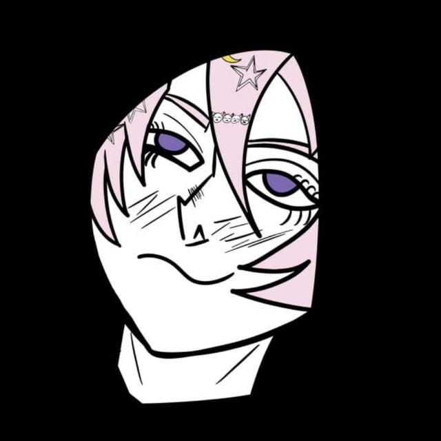

# CppTUIEngine


[](README_ru.md)

<div align="center">
  
</div>

# Engine on C++ for TUI

This is a simple C++ engine for creating Text User Interface (TUI). It combines speed and simplicity, but at the same time detailed customization of elements. It doesn't use any other libraries, just pure C++. Usable only for Windows.

[Full documentation]()

Here will be quick and superficial documentation on installation and use of the latest version of the engine

# Installing

For installing CppTUIEngine on computer complete in cmd:

``` bash
git clone https://github.com/UbicaTravy/CppTUIEngine
```

Good! You installed CppTUIEngine on your computer.

## Sructure

```
CppTUIEngine/
 |helper/
 |-build_tool.cpp
 |-comp.bat <--- It building just build_tool.cpp!
 |menu/
 |-menu.cpp
 |-menu.h
 |console_utils.cpp <--- Main file of engine
 |console_utils.h
 |main.cpp <--- Your script
```

## Using

At the beginning of the file there are imports of headers and .cpp files of the engine, as well as Windows.h

```cpp
#include "console_utils.h" // for working with text and base funcional
#include "menu/menu.h" // menu
#include <iostream>
#include <string>
#include <windows.h>
#include <conio.h> // _getch()
```

First, let's initialize the background and font color

```cpp
setColor(15, 1); // white on black fone
```

Let's create a simple menu

```cpp
std::vector<std::string> menuItems = {
    "1. 1",
    "2. 2", 
    "3. Exit"
};

// Create a menu:
// '+' - symbol before the selected item
// ' ' - symbol before unselected items
Menu menu(menuItems, '+', ' ');
```

Now let's display the menu and process the selection.

```cpp
int main() {
    int width, height;
    getConsoleSize(width, height);
    
    // Initializing colors
    setColor(15, 1);
    
    // Drawing a menu for the first time
    clearScreen();
    menu.draw((width - 20) / 2, height / 2 - 1);
    
    while (true) {
        if (_kbhit()) {
            int ch = _getch();
            
            // Handling of arrows
            if (ch == 224 || ch == 0) {
                ch = _getch();
                if (ch == 72) { // arrow up
                    menu.moveUp();
                } else if (ch == 80) { // arrow down
                    menu.moveDown();
                }
                
                // Refreshing the screen
                clearScreen();
                menu.draw((width - 20) / 2, height / 2 - 1);
            }
            // Enter
            else if (ch == '\r') {
                int selectedIdx = menu.getSelectedIndex();
                
                if (selectedIdx == 0) {
                    clearScreen();
                    show_text("Choised 1!", 
                             (width - 20) / 2, height / 2);
                    _getch();
                }
                else if (selectedIdx == 1) {
                    clearScreen();
                    show_text("Choised 2", 
                             (width - 20) / 2, height / 2);
                    _getch();
                }
                else if (selectedIdx == 2) {
                    break; // Exit
                }
                
                // after performing the action, redraw the menu
                clearScreen();
                menu.draw((width - 20) / 2, height / 2 - 1);
            }
        }
    }
    
    return 0;
}
```


Let's add a function so that when the window size changes, the interface adjusts to the new size.

```cpp
// Check console resize
int newWidth, newHeight;
getConsoleSize(newWidth, newHeight);
if (newWidth != width || newHeight != height) {
    width = newWidth;
    height = newHeight;
    clearScreen();
    menu.draw((width - 20) / 2, height / 2 - 1);
}
```

Full code:

```cpp
#include "console_utils.h"
#include "menu/menu.h"
#include <iostream>
#include <string>
#include <windows.h>
#include <conio.h>

void showOption1(int width, int height) {
    clearScreen();
    show_text("You choised 1!", (width - 22) / 2, height / 2);
    show_text("Press any key...", (width - 22) / 2, height / 2 + 1);
    _getch();
}

void showOption2(int width, int height) {
    clearScreen();
    show_text("You choised 1!", (width - 22) / 2, height / 2);
    show_text("Press any key...", (width - 22) / 2, height / 2 + 1);
    _getch();
}

int main() {
    int width, height;
    getConsoleSize(width, height);
    
    setColor(15, 1);
    
    std::vector<std::string> menuItems = {
        "1. 1",
        "2. 2",
        "3. Exit"
    };
    
    Menu menu(menuItems, '>', ' ');

    clearScreen();
    show_text("Main menu", (width - 11) / 2, 2);
    menu.draw((width - 20) / 2, height / 2 - 1);
    
    while (true) {
        if (_kbhit()) {
            int ch = _getch();
            
            if (ch == 224 || ch == 0) {
                ch = _getch();
                if (ch == 72) menu.moveUp();
                else if (ch == 80) menu.moveDown();
                
                clearScreen();
                show_text("Main menu", (width - 11) / 2, 2);
                menu.draw((width - 20) / 2, height / 2 - 1);
            }
            else if (ch == '\r') {
                int selected = menu.getSelectedIndex();
                
                if (selected == 0) showOption1(width, height);
                else if (selected == 1) showOption2(width, height);
                else if (selected == 2) break;
                
                clearScreen();
                show_text("Main menu", (width - 11) / 2, 2);
                menu.draw((width - 20) / 2, height / 2 - 1);
            }
        }
        
        int newWidth, newHeight;
        getConsoleSize(newWidth, newHeight);
        if (newWidth != width || newHeight != height) {
            width = newWidth;
            height = newHeight;
            clearScreen();
            show_text("Main menu", (width - 11) / 2, 2);
            menu.draw((width - 20) / 2, height / 2 - 1);
        }
    }
    
    // Restoration of colors
    setColor(15, 0);
    clearScreen();
    return 0;
}
```

## Building and relise

The engine has an assistant for assembling and running the project. But first you need to assemble it. Go to the `helper` folder and run the `comp.cmd` file. The .exe file does not come with this assistant due to the difference in architecture and for convenience, change the commands in it or add something of your own.

After assembling, build_tool.exe will appear in the main project folder, run it. Select the `Build and Run` item with the arrows. If there are no errors and `g++` is installed, the project will build and run.

This assembly only builds for this computer. For release, select `Build Release (static)`. NOTE, THERE IS A STATIC LINK FIRST! Your assembled release will appear in the `build` folder.

<div align="center">

### Created by KillerGrass

 

[](https://github.com/UbicaTravy)

[](https://t.me/killergrass_programms)

[](https://t.me/kanal_kashkamalhika)

</div>

<div align="center">

## Contacts

[](https://t.me/killer_grass1834)
[](mailto:killergrasscontact@gmail.com)
</div>